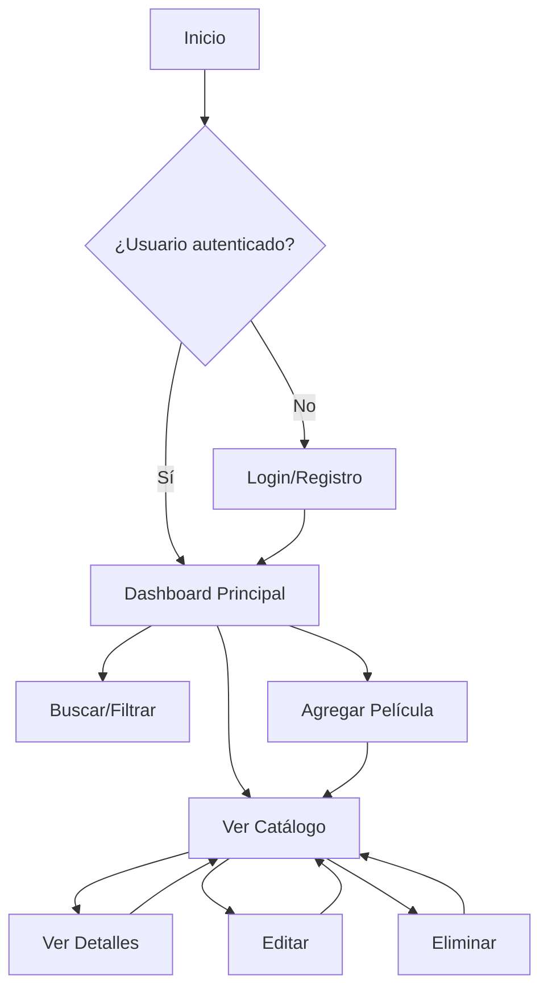

<div align="center">

# 🎬 CineFlix

### Sistema de Gestión de Películas con CRUD y Autenticación

[](https://developer.mozilla.org/es/docs/Web/HTML)
[](https://developer.mozilla.org/es/docs/Web/CSS)
[](https://developer.mozilla.org/es/docs/Web/JavaScript)
[](https://getbootstrap.com/)

[Demo en Vivo](#) · [Reportar Bug](../../issues) · [Solicitar Feature](../../issues)

</div>

---

## 📋 Descripción

**CineFlix** es una aplicación web frontend para la gestión completa de un catálogo de películas mediante operaciones **CRUD** (Crear, Leer, Actualizar, Eliminar), con sistema de autenticación de usuarios y persistencia de datos utilizando `localStorage`.

Ideal para aprender y practicar:
- ✅ Manipulación del DOM con JavaScript Vanilla
- ✅ Persistencia de datos en el navegador
- ✅ Arquitectura modular y organización de código
- ✅ Integración con Bootstrap 5
- ✅ Manejo de formularios y validaciones

---

## ✨ Características Principales

### 🔐 Sistema de Autenticación
- ✔️ **Registro** de nuevos usuarios con validación
- ✔️ **Inicio de sesión** con credenciales
- ✔️ **Persistencia de sesión** mediante `localStorage`
- ✔️ **Cierre de sesión** seguro (logout)
- ✔️ Protección de rutas según estado de autenticación

### 🎥 Gestión de Películas (CRUD Completo)
- ➕ **Crear**: Añadir nuevas películas con formulario modal
- 📖 **Leer**: Visualizar catálogo en grid responsivo
- ✏️ **Actualizar**: Editar información desde modal dinámico
- 🗑️ **Eliminar**: Borrar películas con confirmación de seguridad

### 🔍 Búsqueda y Filtros Avanzados
- 🔎 **Búsqueda en tiempo real** por título, director o descripción
- 🎭 **Filtro dinámico** por género cinematográfico
- 🎞️ **Carrusel horizontal** de películas más recientes
- 📊 Actualización automática del catálogo al filtrar

### 🎨 Interfaz de Usuario
- 📱 **Diseño responsivo** compatible con móviles, tablets y escritorio
- 🌙 Tarjetas (cards) con hover effects
- 🪟 Modales para formularios y detalles
- ⚡ Transiciones y animaciones suaves
- 🎯 Navegación intuitiva con Bootstrap Icons

---

## 🛠️ Tecnologías Utilizadas

| Tecnología | Versión | Uso |
|-----------|---------|-----|
| **HTML5** | - | Estructura semántica |
| **CSS3** | - | Estilos personalizados y animaciones |
| **JavaScript** | ES6+ | Lógica de aplicación (Vanilla JS) |
| **Bootstrap** | 5.x | Framework CSS y componentes UI |
| **Bootstrap Icons** | 1.x | Iconografía |
| **LocalStorage API** | - | Persistencia de datos en el navegador |

---

## 🚀 Instalación y Uso

### Requisitos Previos
- Navegador web moderno (Chrome, Firefox, Edge, Safari)
- No requiere Node.js ni servidor backend

### Pasos de Instalación

1. **Clona el repositorio**
```bash
git clone https://github.com/alejohdez07/pagina-de-peliculas.git
```

2. **Navega al directorio del proyecto**
```bash
cd pagina-de-peliculas
```

3. **Abre el archivo `index.html`**
   - Doble clic en el archivo, o
   - Usa Live Server en VS Code, o
   - Abre desde el navegador: `Archivo > Abrir archivo`

4. **¡Listo!** 🎉 La aplicación se ejecutará en tu navegador

---

## 👥 Usuarios de Prueba

Puedes iniciar sesión con estas credenciales predefinidas:

| Usuario | Contraseña | Rol |
|---------|-----------|------|
| `admin` | `admin123` | Administrador |
| `usuario` | `1234` | Usuario estándar |
| `demo` | `demo` | Usuario demo |

> 💡 **Tip**: También puedes crear nuevas cuentas desde la sección de registro.

---

## 💾 Estructura de Almacenamiento

La aplicación utiliza las siguientes claves en `localStorage`:

| Clave | Descripción | Formato |
|-------|-------------|---------|
| `peliculas` | Catálogo completo de películas | Array de objetos JSON |
| `usuarios` | Base de datos de usuarios registrados | Array de objetos JSON |
| `sesion` | Información del usuario autenticado | Objeto JSON o `null` |

### Ejemplo de Estructura de Datos

```javascript
// Película
{
  id: "uuid-v4",
  titulo: "El Padrino",
  director: "Francis Ford Coppola",
  anio: 1972,
  genero: "Drama",
  duracion: 175,
  calificacion: 9.2,
  descripcion: "La historia de la familia Corleone...",
  imagen: "https://ejemplo.com/poster.jpg"
}

// Usuario
{
  id: "uuid-v4",
  username: "usuario123",
  password: "1234", // ⚠️ Texto plano (no seguro en producción)
  fechaRegistro: "2026-02-13T10:30:00Z"
}
```

---

## 📂 Estructura del Proyecto

```
pagina-de-peliculas/
├── index.html           # Página principal
├── login.html           # Página de autenticación
├── css/
│   └── styles.css       # Estilos personalizados
├── js/
│   ├── app.js           # Lógica principal
│   ├── auth.js          # Sistema de autenticación
│   ├── crud.js          # Operaciones CRUD
│   └── utils.js         # Funciones auxiliares
└── README.md            # Este archivo
```

---

## 🔄 Flujo de Uso



1. El usuario accede a la aplicación
2. Se registra o inicia sesión
3. Se habilita la vista principal con:
   - Buscador y filtro por género
   - Carrusel de películas recientes
   - Catálogo en formato grid/cards
4. Puede agregar nuevas películas mediante modal
5. Cada tarjeta permite:
   - 👁️ Ver detalles completos
   - ✏️ Editar información
   - 🗑️ Eliminar (con confirmación)
6. Todos los cambios se guardan automáticamente en `localStorage`

---

## ⚠️ Limitaciones Conocidas

| Limitación | Descripción |
|-----------|-------------|
| 🔓 **Seguridad** | Las contraseñas se almacenan en texto plano (no hay cifrado) |
| 💾 **Persistencia** | Los datos se pierden si se limpia el almacenamiento del navegador |
| 🌐 **Backend** | No existe servidor ni base de datos real |
| 👤 **Roles** | No hay sistema avanzado de permisos o roles de usuario |
| 📊 **Escalabilidad** | Limitado a ~5MB de datos en `localStorage` |
| 🔗 **Validación** | Validaciones básicas de formularios |

---

## 🚀 Roadmap / Mejoras Futuras

### Prioridad Alta
- [ ] 🔐 Implementar hash de contraseñas (bcrypt o similar)
- [ ] ✅ Validaciones más estrictas:
  - [ ] URL de imágenes
  - [ ] Rangos de año (1888-2026)
  - [ ] Calificación (0-10)
- [ ] 📄 Paginación del catálogo de películas

### Prioridad Media
- [ ] 📤 Exportar / Importar datos en formato JSON
- [ ] 🎨 Modo oscuro (dark mode)
- [ ] 🖼️ Soporte para subir imágenes locales
- [ ] ⭐ Sistema de favoritos por usuario
- [ ] 🔔 Notificaciones toast más elaboradas

### Prioridad Baja
- [ ] 🌐 Implementar backend con API REST (Node.js + Express)
- [ ] 🗄️ Migrar a base de datos (MongoDB/PostgreSQL)
- [ ] 🧪 Pruebas unitarias y de integración (Jest/Vitest)
- [ ] 🔍 SEO y metadatos Open Graph
- [ ] 📱 PWA (Progressive Web App)

---

## 🤝 Contribuciones

¡Las contribuciones son bienvenidas! Si deseas mejorar el proyecto:

1. Haz un **fork** del repositorio
2. Crea una **rama** para tu feature (`git checkout -b feature/nueva-funcionalidad`)
3. **Commitea** tus cambios (`git commit -m 'Añadir nueva funcionalidad'`)
4. Haz **push** a la rama (`git push origin feature/nueva-funcionalidad`)
5. Abre un **Pull Request**

---

## 📄 Licencia

Este proyecto es de código abierto y está disponible bajo la [Licencia MIT](LICENSE).

---

## 👨‍💻 Autor

Desarrollado con ❤️ por **[alejohdez07](https://github.com/alejohdez07)**

[](https://github.com/alejohdez07)

---

## 📞 Soporte

Si tienes preguntas o problemas:
- 🐛 [Reportar un bug](../../issues/new?labels=bug)
- 💡 [Solicitar una característica](../../issues/new?labels=enhancement)
- 📧 Contacto directo: [crear issue](../../issues)

---

<div align="center">

### ⭐ Si te gustó este proyecto, dale una estrella en GitHub

**¡Gracias por tu interés en CineFlix!**

</div>
